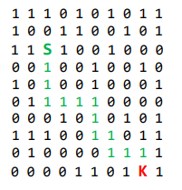

# The Maze
## Course
Algorithms and data structures
# Goal
The task is to find a way out of the maze. Labyrinth is created by randomly generating a zero-one matrix of 10x10 and two points: S-Start, K-Finish

The solution should be the answer whether there is a route from point A to point K assuming that:
* We can move only up, down, left and right
* 1 means the way is possible; 0 means no passage

## Example


Output: 
```
Start (3,3), Finish (10,9)
The path exists: (3,3),(4,3),(5,3),(6,3),(6,4),(6,5),(6,6),(7,6),(8,6),(8,7),(9,7),(9,8),(9,9),(10,9)
```
# Program run and solution

### Run
To start the program, run the `Main` class with the one parameter of the maze size.
Program makes default maze of the size 10x10.
Maximum maze size is 50x50.

### Solution
The program is generating `solution.html` HTML file (in the project directory) in order to visualise the solution.

### Used algorithms
Program uses BFS algorithm to find the path
